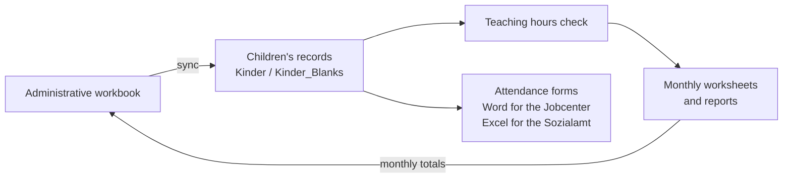

# Nachhilfe Kolibri

Excel VBA that runs the tutoring administration at Kinder- und Elternzentrum Kolibri e.V. in Dresden. Tutoring paid for by the Jobcenter or the Sozialamt through the education and participation benefits ("Bildung und Teilhabe") comes with monthly paperwork for every child: checked teaching hours, reports per approval period and attendance forms for the funding office. These macros produce that paperwork from the centre's workbooks.

There are no screenshots: the real workbooks contain personal data of children and families, and the repository doesn't ship a demo workbook.

## What the code does

- Checks the recorded teaching hours, including weeks that span two months.
- Prepares monthly worksheets and reports, also for children with several approval periods.
- Keeps the working records consistent: syncs `Kinder` and `Kinder_Blanks`, resolves duplicates and normalizes identifiers.
- Syncs with the administrative workbook and transfers the monthly values.
- Fills editable Word attendance forms for the Jobcenter and Excel forms for the Sozialamt, and validates the benefit reference numbers.
- Includes the worksheet event handlers and the progress dialog that the reports rely on.

## Repository layout

| Path | Contents |
| --- | --- |
| [vba/modules/](vba/modules/) | 52 standard modules |
| [vba/classes/](vba/classes/) | 4 class modules |
| [vba/forms/](vba/forms/) | `frmProgress.frm` and its `.frx` resource |
| [vba/worksheets/](vba/worksheets/) | Event code for the `Kinder` and `Kinder_Blanks` sheets |
| [docs/INTEGRATION.md](docs/INTEGRATION.md) | How to import the code, workbook and template contracts, entry points and checks |
| [docs/SOURCE_STATUS.md](docs/SOURCE_STATUS.md) | Where the sources come from and what has been verified |

## Requirements

Desktop Excel on Windows with macros enabled, and desktop Word for the DOCX forms. COM objects (`Scripting.Dictionary`, `Scripting.FileSystemObject`, `VBScript.RegExp`, `ADODB.Stream`, `WScript.Shell`) are late-bound, so no references need to be set.

The code expects the centre's workbook layout and local Word and Excel templates, which are not included. Read the [integration guide](docs/INTEGRATION.md) before importing anything: the files are UTF-8 and need encoding-aware import, and the worksheet code has to go into the matching sheet modules. Try changes in a copy of the workbook with invented records.

## Status

The sources were compared module by module with the workbook in use. One change is ahead of it: Sozialamt records now get only the Excel form, and Word is started only when a DOCX form is needed. That change is documented but hasn't been run in the updated workbook yet. Self-checks for reference-number normalization and synthetic form generation are included. [docs/SOURCE_STATUS.md](docs/SOURCE_STATUS.md) lists the details and the remaining limits.

## How it's built

Developed by Dr. Konstantin S. Shakun with AI coding agents. I define the workflows and workbook contracts and accept each change; the agents write most of the VBA.

## License

© Kinder- und Elternzentrum Kolibri e.V., Dresden. The code is published for reference; reusing it requires the association's written permission. See [LICENSE](LICENSE).
